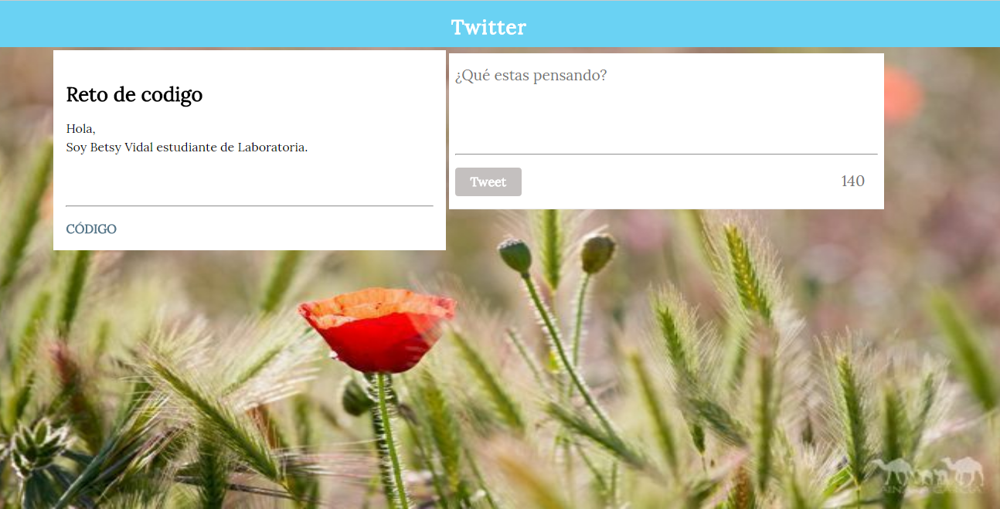

# Twitter

## Objetivo

- El objetivo de esta pagina es replicar el newsfeed de Twitter utilizando HTML5 para crear la estructura, CSS3 para brindar estilo y JS para dar interaccion a la página.

## Flujo de trabajo

- Primero creamos la estructura HTML, en forma anidada.
- Comentar el código.
- Enlazamos la URL de la letra lora, que usaremos para dar estilo a los titulos y textos.
- Enlazamos el archivo externo del CSS, esto para un mayor orden y hacer uso de las buenas practicas.
- Enlazamos el archivo externo de JS, esto para un mayor orden y hacer uso de las buenas practicas.
- Luego continuamos trabajando en CSS, en forma de cascada.
- Comentar el código.
- Subimos avances a github.
- Terminar de dar estilo con CSS.
- Empezamos a trabajar en JS, para dar interacción a la página.
- Comentar el código.
- Subimos avances a github.
- Terminamos las seis versiones pedidas.
- Digitar el archivo README.md
- Subir el producto final a github.
- Crear la rama "gh-pages".

## Herramientas Utilizadas

- html, para la estructura del contenido.
- css, para darle estilo al contenido.
- js, para darle interaccion a la página.

## Fuentes consultadas

- [Laboratoria LMS] : https://lms.laboratoria.la/cohorts/lim-2017-09-bc-core-pm/courses/interactive-site/01-making-your-site-interactive/00-opening
- [MDN web] : https://developer.mozilla.org/es/docs/Web/API/Element/scrollHeight

## Imagen 

